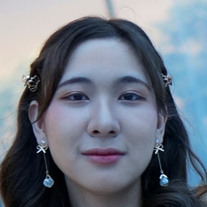
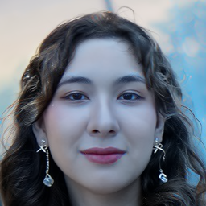

# Official implementation of Diffusion Autoencoders

A CVPR 2022 (ORAL) paper ([paper](https://openaccess.thecvf.com/content/CVPR2022/html/Preechakul_Diffusion_Autoencoders_Toward_a_Meaningful_and_Decodable_Representation_CVPR_2022_paper.html), [site](https://diff-ae.github.io/), [5-min video](https://youtu.be/i3rjEsiHoUU)):

```
@inproceedings{preechakul2021diffusion,
      title={Diffusion Autoencoders: Toward a Meaningful and Decodable Representation}, 
      author={Preechakul, Konpat and Chatthee, Nattanat and Wizadwongsa, Suttisak and Suwajanakorn, Supasorn},
      booktitle={IEEE Conference on Computer Vision and Pattern Recognition (CVPR)}, 
      year={2022},
}
```

## Usage

[](https://drive.google.com/file/d/1OTfwkklN-IEd4hFk4LnweOleyDtS4XTh/view?usp=sharing)

Note: Since we expect a lot of changes on the codebase, please fork the repo before using.

### Prerequisites

See `requirements.txt`

```
pip install -r requirements.txt
```

### Quick start

A jupyter notebook.

For unconditional generation: `sample.ipynb`

For manipulation: `manipulate.ipynb`

For interpolation: `interpolate.ipynb`

For autoencoding: `autoencoding.ipynb`

Aligning your own images:

1. Put images into the `imgs` directory
2. Run `align.py` (need to `pip install dlib requests`)
3. Result images will be available in `imgs_align` directory

<table>
<tr>
<th width="33%">
Original in <code>imgs</code> directory<br>
</th>
<th width="33%">
Aligned with <code>align.py</code><br>
</th>
<th width="33%">
Using <code>manipulate.ipynb</code><br>
</th>
</tr>
</table>


### Checkpoints

We provide checkpoints for the following models:

1. DDIM: **FFHQ128** ([72M](https://vistec-my.sharepoint.com/:f:/g/personal/nattanatc_pro_vistec_ac_th/Env4aOdJJB1FqBgwAr8XPhEB6Z-CqHgDPVg8rSo2H2jk4A?e=clINeb), [130M](https://vistec-my.sharepoint.com/:f:/g/personal/nattanatc_pro_vistec_ac_th/Ej3MniHs2u9ClDEJZIK3ECkB0yzcxig70Ht8WjyFjSk4Xw?e=1HKVh3)), [**Bedroom128**](https://vistec-my.sharepoint.com/:f:/g/personal/nattanatc_pro_vistec_ac_th/EliGmm5WNbBPmSvg1aQsCA4BDmWthQpN3G0TD3n0lVHqvw?e=tPmLhQ), [**Horse128**](https://vistec-my.sharepoint.com/:f:/g/personal/nattanatc_pro_vistec_ac_th/ElAkltpC7rNCmv-btykB0GABwyPm43zaLO-xU3QOAhYIEg?e=X1n7Rh)
2. DiffAE (autoencoding only): [**FFHQ256**](https://vistec-my.sharepoint.com/:f:/g/personal/nattanatc_pro_vistec_ac_th/Ev2D_RNV2llIvm2yXyKgUxAB6w8ffg0C9NWSOtFqPMYQuw?e=f2kWUa), **FFHQ128** ([72M](https://vistec-my.sharepoint.com/:f:/g/personal/nattanatc_pro_vistec_ac_th/EjhCsOLfrxxIp280aDTucD8BlMFGhV0TB0YYIb7TsptLfw?e=uaeGHl), [130M](https://vistec-my.sharepoint.com/:f:/g/personal/nattanatc_pro_vistec_ac_th/EkFWetLoMO9GlJtox1lnOY8BARWeEgUlo1_NAkuYA9dcUQ?e=j5t9xo)), [**Bedroom128**]https://vistec-my.sharepoint.com/:f:/g/personal/nattanatc_pro_vistec_ac_th/Eruk1AX6OY1Hl46nht71tD4BCfObB0Ik90JFwry6wwyM2A?e=QCuGd1), [**Horse128**](https://vistec-my.sharepoint.com/:f:/g/personal/nattanatc_pro_vistec_ac_th/El0mTakkBllJnMgYyQHTTOAB9-VP8jJuwRvwzKEXaS7rcg?e=49GnjU)
3. DiffAE (with latent DPM, can sample): [**FFHQ256**](https://vistec-my.sharepoint.com/:f:/g/personal/nattanatc_pro_vistec_ac_th/EtYAk4GzroFFv0yxG-YOM4MBhA2i_e_RYpOHYyrcziZHIQ?e=EGxBnQ), [**FFHQ128**](https://vistec-my.sharepoint.com/:f:/g/personal/nattanatc_pro_vistec_ac_th/Ejg583SBk3JLhLp2XSpkPlkBoLeGAkJ842pK0Q1CXiseqQ?e=KYxVkZ), [**Bedroom128**](https://vistec-my.sharepoint.com/:f:/g/personal/nattanatc_pro_vistec_ac_th/EhA3tb4iR8xIt8dHcHyhPF4BZ42Nb3OWKg2HkeVsWStk4w?e=IvOzT8), [**Horse128**](https://vistec-my.sharepoint.com/:f:/g/personal/nattanatc_pro_vistec_ac_th/Eg9Ksex71kFOlFhFna4EBVIB2QdC8oR3ooV5POw-gUyOxg?e=AqAr6c)
4. DiffAE's classifiers (for manipulation): [**FFHQ256's latent on CelebAHQ**](https://vistec-my.sharepoint.com/:f:/g/personal/nattanatc_pro_vistec_ac_th/EidZBd5t375KrGPnUhcLZ10B0LPKDnQXUp8ffrsBTlPWqw?e=Frovs7), [**FFHQ128's latent on CelebAHQ**](https://vistec-my.sharepoint.com/:f:/g/personal/nattanatc_pro_vistec_ac_th/Er7et8P5-ZFOsFEFCRDgMPgBIt0jaknGAUZ9QYaSr09ljw?e=VxPKLd)

Checkpoints ought to be put into a separate directory `checkpoints`. 
Download the checkpoints and put them into `checkpoints` directory. It should look like this:

```
checkpoints/
- bedroom128_autoenc
    - last.ckpt # diffae checkpoint
    - latent.ckpt # predicted z_sem on the dataset
- bedroom128_autoenc_latent
    - last.ckpt # diffae + latent DPM checkpoint
- bedroom128_ddpm
- ...
```


### LMDB Datasets

We do not own any of the following datasets. We provide the LMDB ready-to-use dataset for the sake of convenience.

- [FFHQ](https://drive.google.com/drive/folders/1ww7itaSo53NDMa0q-wn-3HWZ3HHqK1IK?usp=sharing)
- [CelebAHQ](https://drive.google.com/drive/folders/1SX3JuVHjYA8sA28EGxr_IoHJ63s4Btbl?usp=sharing) 
- [CelebA](https://drive.google.com/drive/folders/1HJAhK2hLYcT_n0gWlCu5XxdZj-bPekZ0?usp=sharing) 
- [LSUN Bedroom](https://drive.google.com/drive/folders/1O_3aT3LtY1YDE2pOQCp6MFpCk7Pcpkhb?usp=sharing)
- [LSUN Horse](https://drive.google.com/drive/folders/1ooHW7VivZUs4i5CarPaWxakCwfeqAK8l?usp=sharing)

The directory tree should be:

```
datasets/
- bedroom256.lmdb
- celebahq256.lmdb
- celeba.lmdb
- ffhq256.lmdb
- horse256.lmdb
```

You can also download from the original sources, and use our provided codes to package them as LMDB files.
Original sources for each dataset is as follows:

- FFHQ (https://github.com/NVlabs/ffhq-dataset)
- CelebAHQ (https://github.com/switchablenorms/CelebAMask-HQ)
- CelebA (https://mmlab.ie.cuhk.edu.hk/projects/CelebA.html)
- LSUN (https://github.com/fyu/lsun)

The conversion codes are provided as:

```
data_resize_bedroom.py
data_resize_celebhq.py
data_resize_celeba.py
data_resize_ffhq.py
data_resize_horse.py
```

Google drive: https://drive.google.com/drive/folders/1abNP4QKGbNnymjn8607BF0cwxX2L23jh?usp=sharing


## Training

We provide scripts for training & evaluate DDIM and DiffAE (including latent DPM) on the following datasets: FFHQ128, FFHQ256, Bedroom128, Horse128, Celeba64 (D2C's crop).
Usually, the evaluation results (FID's) will be available in `eval` directory.

Note: Most experiment requires at least 4x V100s during training the DPM models while requiring 1x 2080Ti during training the accompanying latent DPM. 


**FFHQ128**
```
# diffae
python run_ffhq128.py
# ddim
python run_ffhq128_ddim.py
```

A classifier (for manipulation) can be trained using:
```
python run_ffhq128_cls.py
```

**FFHQ256**

We only trained the DiffAE due to high computation cost.
This requires 8x V100s.
```
sbatch run_ffhq256.py
```

After the task is done, you need to train the latent DPM (requiring only 1x 2080Ti)
```
python run_ffhq256_latent.py
```

A classifier (for manipulation) can be trained using:
```
python run_ffhq256_cls.py
```

**Bedroom128**

```
# diffae
python run_bedroom128.py
# ddim
python run_bedroom128_ddim.py
```

**Horse128**

```
# diffae
python run_horse128.py
# ddim
python run_horse128_ddim.py
```

**Celeba64**

This experiment can be run on 2080Ti's.

```
# diffae
python run_celeba64.py
```
